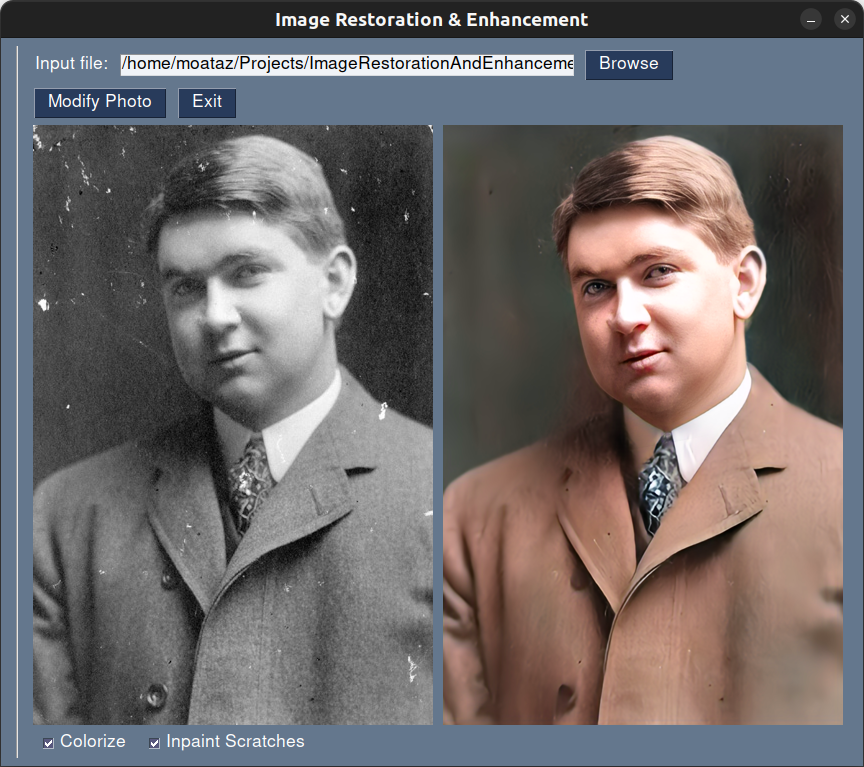
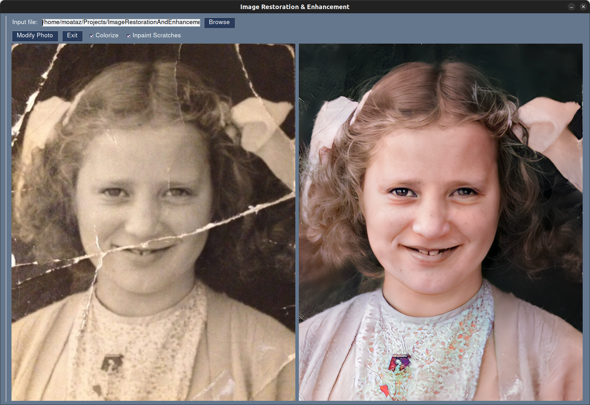
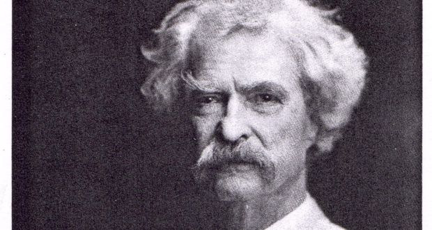
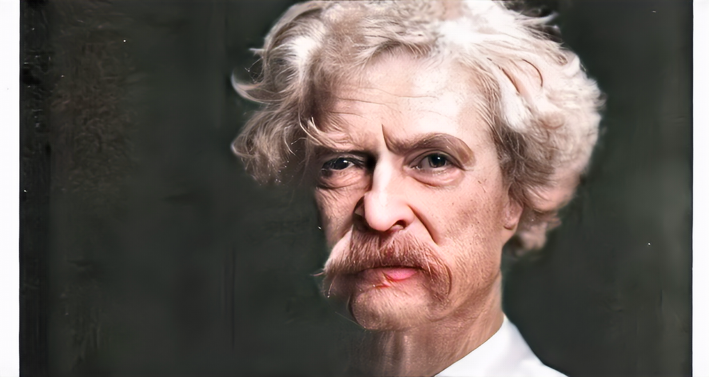

Graduation project for image restoration, enhancement & colorization.

## Installation

Run `setup.sh` to download weights & models & stuff. 

## Running

Run `main.py` to generate results. Input directory is `sample_images`, but you can change that (see `run` in `main.py`).

## GUI

There's also a GUI app that's built with [PySimpleGUI](https://github.com/PySimpleGUI/PySimpleGUI). See/run `gui.py`.

You can also download the project from [this link](http://mizosoft.imagerestoration.pysimplegui.org). The link is hosted by [PySimpleGUI](https://github.com/PySimpleGUI). It includes the needed weights/models (about 4.5GB in total with the code). The GUI also looks nicer (e.g. it's modified to run the lengthy operations in another thread, so the GUI doesn't hang). 

## Output

According to `RunMode` and whether `colorize` is set, output is either `<output-dir>/face_restore` or `<output-dir>/quality_enh/restored_image`
or `<output-dir>/colorization` (also see `run` in `main.py`).

## Sample resulst

## TODO 

 - Supplant out-of-the-box face restoration in scratched photos with GPEN's face inpainting. Not sure if it'd work though.
   We'd have to blend in the restored face to the result of running vanilla scratch restoration.

## Credits

[Old photo restoration by deep latent space translation](https://github.com/microsoft/Bringing-Old-Photos-Back-to-Life)

[GPEN](https://github.com/yangxy/GPEN)

[DeOldify](https://github.com/jantic/DeOldify)
